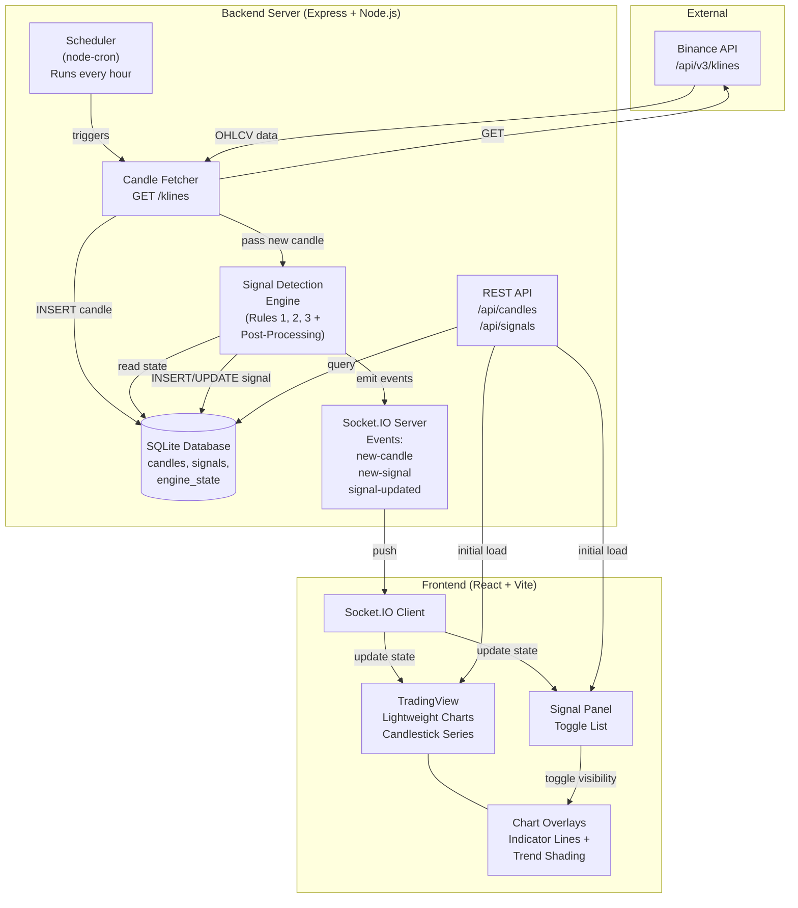

# Kickstart Implementation Plan — Real-Time BTC Alerting System

> **Goal:** Build a locally-hosted, full-stack web application that fetches BTC hourly candles in real time, detects confirmed uptrend signals incrementally (without re-scanning history), and displays everything on an interactive candlestick chart with toggleable signal overlays.

---

## Table of Contents

1. [Recommended Tech Stack](#recommended-tech-stack)
2. [System Architecture](#system-architecture)
3. [Project Structure](#project-structure)
4. [Database Schema](#database-schema)
5. [Backend Design](#backend-design)
6. [Frontend Design](#frontend-design)
7. [Incremental Signal Detection Engine](#incremental-signal-detection-engine)
8. [Phased Implementation Roadmap](#phased-implementation-roadmap)

---

## Recommended Tech Stack

> **IMPORTANT: Single language throughout — TypeScript.** Every layer — frontend, backend, detection engine, and database queries — uses TypeScript for consistency, shared types, and reduced context-switching.

| Layer | Technology | Rationale |
|---|---|---|
| **Frontend Framework** | React 18+ via **Vite** | Fast HMR, lightweight, widely supported |
| **Charting** | **TradingView Lightweight Charts v5** | Purpose-built for financial candlesticks; ~45KB; native pan/zoom, markers, and plugin API for custom overlays |
| **Styling** | Vanilla CSS (CSS custom properties) | Full control, no framework lock-in, dark-mode-ready |
| **Backend Runtime** | **Node.js + Express** | Proven, minimal, pairs naturally with TypeScript |
| **Real-Time Transport** | **Socket.IO** | Auto-reconnect, rooms, fallback to polling; simpler than raw WebSocket |
| **Database** | **SQLite** via `better-sqlite3` | Zero-config, file-based, perfect for local-first apps |
| **ORM / Query Builder** | **Drizzle ORM** | Type-safe, SQL-first, uses `better-sqlite3` as driver, auto-migrations |
| **Scheduler** | **node-cron** | Lightweight cron-like scheduling for hourly candle fetches |
| **Data Source** | **Binance Public API** (`/api/v3/klines`) | Already proven in existing `fetch_btc_candles.js` |

---

## System Architecture



### Data Flow — Real-Time Cycle (Every Hour)

```
1. node-cron fires → Candle Fetcher hits Binance → new candle row → DB
2. New candle passed to Signal Detection Engine
3. Engine reads recent state (last few candles + active trends) from DB
4. Engine evaluates Rules 1, 2, 3 incrementally against new candle
5. If signal detected → INSERT to signals table → run post-processing filter
6. Socket.IO emits: `new-candle` + optionally `new-signal` / `signal-updated`
7. Frontend receives events → appends candle to chart → updates signal panel
```

---

## Project Structure

```
project_blueprint/
├── KICKSTART_IMPLEMENTATION_PLAN.md   ← this file
├── strategy.md                        ← copied from root
├── decision_tree.md                   ← copied from root
│
└── app/                               ← the actual application
    ├── package.json                   ← root workspace config (npm workspaces)
    ├── tsconfig.base.json             ← shared TS config
    │
    ├── shared/                        ← shared TypeScript types
    │   └── types.ts                   ← Candle, Signal, EngineState interfaces
    │
    ├── server/                        ← backend
    │   ├── package.json
    │   ├── tsconfig.json
    │   ├── src/
    │   │   ├── index.ts               ← Express + Socket.IO server entry
    │   │   ├── config.ts              ← hardcoded config (start time, symbol, interval)
    │   │   ├── db/
    │   │   │   ├── schema.ts          ← Drizzle schema definitions
    │   │   │   ├── migrate.ts         ← migration runner
    │   │   │   └── connection.ts      ← better-sqlite3 + Drizzle setup
    │   │   ├── services/
    │   │   │   ├── candleFetcher.ts   ← Binance API client
    │   │   │   ├── signalEngine.ts    ← incremental detection (Rules 1-3)
    │   │   │   └── scheduler.ts       ← node-cron hourly job
    │   │   ├── routes/
    │   │   │   ├── candles.ts         ← GET /api/candles
    │   │   │   └── signals.ts         ← GET /api/signals
    │   │   └── socket/
    │   │       └── handler.ts         ← Socket.IO event emitters
    │   └── data/
    │       └── alerting.db            ← SQLite database file
    │
    └── client/                        ← frontend
        ├── package.json
        ├── tsconfig.json
        ├── vite.config.ts
        ├── index.html
        └── src/
            ├── main.tsx               ← React entry
            ├── App.tsx                ← layout + routing
            ├── index.css              ← global styles + design tokens
            ├── components/
            │   ├── CandlestickChart.tsx    ← TradingView LWC wrapper
            │   ├── SignalPanel.tsx         ← toggleable signal list
            │   ├── SignalOverlay.tsx       ← indicator lines + shading
            │   ├── StatusBar.tsx           ← connection status, last update
            │   └── Header.tsx             ← app title + controls
            ├── hooks/
            │   ├── useSocket.ts           ← Socket.IO connection hook
            │   ├── useCandles.ts          ← candle data fetching + live
            │   └── useSignals.ts          ← signal data fetching + live
            └── utils/
                └── formatters.ts          ← date/price formatting
```

---

## Configuration File

All application settings live in a single hardcoded TypeScript file (`server/src/config.ts`). No database table, no UI — just edit the file and restart.

```typescript
// server/src/config.ts
export const config = {
  // The date/time to start fetching candles from (EST)
  startTime: '2026-05-13 05:00',

  // Binance trading pair — fixed to BTCUSDT
  symbol: 'BTCUSDT',

  // Candle interval
  interval: '1h',

  // Server port
  port: 3001,

  // Database file path (relative to server root)
  dbPath: './data/alerting.db',
} as const;
```

---

## Database Schema

Three tables: candles, signals, and engine state.

### `candles`

| Column | Type | Description |
|---|---|---|
| `id` | INTEGER PK | Auto-increment |
| `open_time` | TEXT UNIQUE | `YYYY-MM-DD HH:MM` (EST) |
| `open` | REAL | Opening price |
| `high` | REAL | High price |
| `low` | REAL | Low price |
| `close` | REAL | Closing price |
| `volume` | REAL | Volume (BTC) |
| `created_at` | TEXT | Insertion timestamp |

### `signals`

| Column | Type | Description |
|---|---|---|
| `id` | INTEGER PK | Auto-increment |
| `start_time` | TEXT | Trend start `YYYY-MM-DD HH:MM` |
| `end_time` | TEXT | Trend end (updated as trend extends) |
| `rule` | TEXT | `Three Green Candles` \| `Close Above Prev High` \| `Close Above Post-Signal Peak` |
| `indicator` | REAL | Indicator price level |
| `indicator_candle_time` | TEXT | Open time of the candle that set the indicator |
| `status` | TEXT | `Ongoing` \| `Broken` |
| `created_at` | TEXT | When detected |
| `updated_at` | TEXT | Last status change |

### `engine_state`

Stores the incremental detection engine's working state so it doesn't need to re-scan history.

| Column | Type | Description |
|---|---|---|
| `id` | INTEGER PK | Always 1 (singleton) |
| `last_processed_time` | TEXT | Open time of last evaluated candle |
| `rule1_green_streak` | INTEGER | Current consecutive green candle count |
| `rule1_streak_start_index` | TEXT | Open time of first candle in current green streak |
| `last_accepted_end` | TEXT | End time of last accepted signal (for cooldown) |
| `state_json` | TEXT | JSON blob for any additional state the engine needs |

---

## Backend Design

### Candle Fetcher (`candleFetcher.ts`)

- **Initialization mode:** On first startup, reads `startTime` from `config.ts`. Fetches all candles from `startTime` to `now` via Binance `/klines` (paginated if needed, max 1000 per request). Inserts to `candles` table, skipping duplicates. Each inserted candle is passed through the signal engine before the next is processed (to maintain correct incremental state).
- **Real-time mode:** Every hour (via `node-cron`), fetches the latest 2 candles (to catch the just-closed candle and handle edge cases). Inserts new candle if not already in DB.
- Emits `new-candle` event via Socket.IO after successful insert.

### Signal Detection Engine (`signalEngine.ts`)

> **IMPORTANT:** This is the most critical component. The engine **must not re-scan all candles**. It evaluates only the latest candle(s) against stored state.

**Core approach:** After each new candle is inserted:

1. Read `engine_state` from DB (last processed index, green streak count, etc.)
2. Load only the candles needed for evaluation (typically the last 4 candles for Rule 2/3 lookback)
3. Evaluate Rules 1, 2, 3 against the new candle:
   - **Rule 1:** Maintain a running green streak counter. When it reaches 3, check indicator condition and emit signal.
   - **Rule 2:** Check if new candle is green + closes above prev high + confirmation gate. Needs candles `[i-3, i-2, i-1, i]`.
   - **Rule 3:** If Rule 2 signal criteria met but gate fails, look up most recent prior signal from `signals` table, scan for peak candle in the window.
4. For ongoing signals: check if the new candle's `low <= indicator`. If so, mark signal as `Broken`, set `end_time` to the previous candle.
5. Run post-processing filters:
   - **Dedup by indicator:** Check if a signal with same indicator value already exists.
   - **Cooldown:** Check if a red candle has closed since the last accepted signal's end.
   - **Same-hour filter:** Reject if `start === end` (this would apply retroactively when a signal breaks on the very next candle).
6. Update `engine_state` in DB.
7. Emit `new-signal` or `signal-updated` via Socket.IO.

### REST API Routes

| Method | Endpoint | Description |
|---|---|---|
| `GET` | `/api/candles` | Returns all candles. Supports `?from=&to=` query params. |
| `GET` | `/api/candles/latest` | Returns the most recent N candles (default 100). |
| `GET` | `/api/signals` | Returns all signals. Supports `?status=ongoing` filter. |

### Socket.IO Events (Server → Client)

| Event | Payload | When |
|---|---|---|
| `new-candle` | `{ candle: Candle }` | After new candle inserted |
| `new-signal` | `{ signal: Signal }` | After new signal detected and accepted |
| `signal-updated` | `{ id, status, end_time }` | When an ongoing signal breaks |
| `engine-status` | `{ lastProcessed, nextFetch }` | Periodic heartbeat |

---

## Frontend Design

### Layout

```
┌─────────────────────────────────────────────────────────┐
│  Header: App Title  |  Status: ● Connected  | Last: 14:00 │
├───────────────────────────────────────────┬─────────────┤
│                                           │             │
│          Candlestick Chart                │   Signal    │
│       (TradingView Lightweight Charts)    │   Panel     │
│                                           │             │
│    ── indicator line (blue, dashed) ──    │  ☑ Signal 1 │
│    ░░ trend shading (semi-transparent) ░░ │  ☐ Signal 2 │
│                                           │             │
│    [pan] [zoom] [reset] built-in          │  Ongoing: 1 │
│                                           │  Broken: 2  │
├───────────────────────────────────────────┴─────────────┤
│  Footer: Data source • Start point • Candle count       │
└─────────────────────────────────────────────────────────┘
```

### CandlestickChart Component

- Uses TradingView Lightweight Charts `createChart()` with `addCandlestickSeries()`
- **Pan & Zoom:** Built-in via LWC — mouse wheel zoom on both axes, click-drag pan
- **Signal overlays** rendered using LWC's plugin API:
  - **Indicator line:** Horizontal price line via `createPriceLine()` on the candlestick series (dashed, colored by rule type)
  - **Trend shading:** Custom plugin using Pane Primitives to draw semi-transparent rectangles between start/end timestamps
  - **Signal markers:** `setMarkers()` to place arrow markers at signal start candles
- Overlay visibility controlled by toggle state from Signal Panel

### Signal Panel Component

- Scrollable list of all detected signals
- Each signal row shows: rule name, indicator price, start/end time, status badge (green for Ongoing, red for Broken)
- Checkbox toggle per signal to show/hide its overlay on the chart
- Filter controls: show all / ongoing only / broken only
- Count summary at the bottom

### Real-Time Updates (via `useSocket` hook)

- On mount: connect to Socket.IO server
- `new-candle` → append to chart data via `series.update()`
- `new-signal` → add to signal list, optionally auto-enable overlay
- `signal-updated` → update status badge, adjust overlay end boundary
- Connection status indicator in header (green dot = connected)

### Design Principles

- **Dark theme** by default (dark background, light text — standard for trading UIs)
- **Minimal chrome** — let the chart dominate the viewport
- **Muted color palette** — rule types get distinct but non-competing colors:
  - Rule 1 (Three Green Candles): `hsl(210, 70%, 60%)` — blue
  - Rule 2 (Close Above Prev High): `hsl(35, 80%, 55%)` — amber
  - Rule 3 (Post-Signal Peak): `hsl(280, 60%, 60%)` — purple
- **Responsive:** Chart resizes with window; signal panel collapses on narrow screens

---

## Incremental Signal Detection Engine

> **IMPORTANT:** This section details how the batch logic from `detect_confirmed_uptrends.js` translates to an incremental, candle-by-candle evaluation.

### Key Differences from Batch Mode

| Aspect | Batch (current) | Incremental (new) |
|---|---|---|
| **Input** | Full candle array | Single new candle + persisted state |
| **Rule 1 streak** | Loop scans forward | Counter maintained in `engine_state` |
| **Rule 3 peak search** | Scans window from prior range | Query DB for green candles in window |
| **Post-processing** | Runs over all ranges at end | Applied per-signal at detection time |
| **Trend invalidation** | Computed inline during forward scan | Checked on each new candle for all `Ongoing` signals |

### Per-Candle Processing Steps

```
function processNewCandle(candle):
    1. INSERT candle into DB
    2. LOAD engine_state
    3. LOAD last 4 candles (for Rule 2/3 lookback)
    4. CHECK all "Ongoing" signals:
       - If candle.low <= signal.indicator:
           → UPDATE signal: status = "Broken", end_time = previous candle time
           → EMIT "signal-updated"
    5. EVALUATE Rule 1:
       - If candle is green: increment green_streak
       - Else: reset green_streak to 0
       - If green_streak == 3: check indicator condition, create signal candidate
       - If green_streak > 3: do nothing (dedup — wait for streak to break)
    6. EVALUATE Rule 2:
       - Load candles[i-3], candles[i-1], candles[i]
       - Check signal + confirmation gate
       - If passes: create signal candidate
    7. EVALUATE Rule 3 (only if Rule 2 signal criteria met but gate failed):
       - Query most recent prior signal from DB
       - Query green candles in peak window from DB
       - Find peak, check confirmation
       - If passes: create signal candidate
    8. For each candidate:
       - DEDUP: check if indicator value already exists in signals table
       - COOLDOWN: check if red candle exists after last accepted signal's end
       - If accepted: INSERT signal, EMIT "new-signal"
    9. UPDATE engine_state
```

### State Persistence

The `engine_state` table stores:
- `rule1_green_streak`: Count of current consecutive green candles (reset on red)
- `rule1_streak_start_index`: The open_time of the first candle in the current green streak (needed to set the indicator = close of that first candle)
- `last_accepted_end`: Used for cooldown filter
- `last_processed_time`: Ensures no candle is processed twice

---

## Phased Implementation Roadmap

### Phase 1 — Project Scaffolding
- [ ] Initialize npm workspace with `server/` and `client/` packages
- [ ] Configure TypeScript (base + per-package)
- [ ] Set up Vite + React for `client/`
- [ ] Set up Express + `ts-node` for `server/`
- [ ] Create `shared/types.ts` with `Candle`, `Signal`, `EngineState` interfaces

### Phase 2 — Database + Candle Fetcher
- [ ] Define Drizzle schema (`candles`, `signals`, `engine_state`, `config`)
- [ ] Set up `better-sqlite3` connection + Drizzle ORM
- [ ] Run initial migration to create tables
- [ ] Build `candleFetcher.ts` — backfill mode (fetch historical candles from Binance)
- [ ] Verify: run backfill from a test start date, confirm candles in DB

### Phase 3 — Signal Detection Engine (Core)
- [ ] Port Rule 1 logic to incremental `signalEngine.ts`
- [ ] Port Rule 2 logic
- [ ] Port Rule 3 logic
- [ ] Implement per-candle invalidation check for ongoing signals
- [ ] Implement post-processing filters (dedup, cooldown, same-hour)
- [ ] Verify: feed historical candles one-by-one, compare output to existing `confirmed_uptrend.md`

> **CRITICAL:** Phase 3 verification is essential. The incremental engine must produce identical results to the batch `detect_confirmed_uptrends.js` for the same input data. Write a test that feeds the same candle set and asserts matching output.

### Phase 4 — REST API + Socket.IO
- [ ] Build REST routes: `/api/candles`, `/api/signals`
- [ ] Set up Socket.IO server with event emitters
- [ ] Wire candle fetcher → engine → socket events
- [ ] Set up `node-cron` scheduler for hourly fetches
- [ ] Verify: start server, confirm API returns data, confirm Socket.IO events fire

### Phase 5 — Frontend: Chart + Data Loading
- [ ] Build `CandlestickChart.tsx` with TradingView Lightweight Charts
- [ ] Build `useCandles` and `useSignals` hooks (REST initial load)
- [ ] Render full candlestick chart with historical data
- [ ] Implement pan and zoom
- [ ] Verify: chart renders correctly with real candle data

### Phase 6 — Frontend: Signal Panel + Overlays
- [ ] Build `SignalPanel.tsx` with toggle checkboxes
- [ ] Implement indicator price lines on chart (per-signal, toggleable)
- [ ] Implement trend shading rectangles (start-to-end, per-signal)
- [ ] Implement signal markers on chart
- [ ] Color-code by rule type
- [ ] Verify: toggle signals on/off, confirm overlays appear/disappear

### Phase 7 — Real-Time Integration + Polish
- [ ] Build `useSocket` hook — connect to Socket.IO, handle events
- [ ] Wire `new-candle` event to chart live update
- [ ] Wire `new-signal` event to signal panel + auto-overlay
- [ ] Wire `signal-updated` event to status updates
- [ ] Add connection status indicator
- [ ] Add status bar (last fetch time, candle count, next fetch countdown)
- [ ] Dark theme polish, responsive layout
- [ ] Verify: let it run for multiple hours, confirm candles + signals appear in real time
