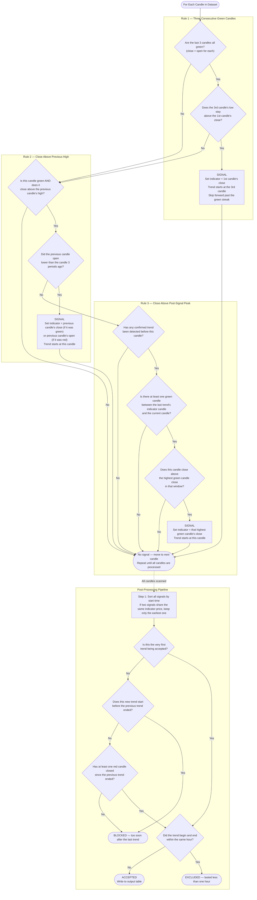

# Confirmed Uptrend — Decision Tree

> Renders in VS Code (Markdown Preview Mermaid Support extension), GitHub, and Obsidian.
> See `strategy_new.md` for full rule definitions.

```mermaid
flowchart TD
    START(["For Each Candle in Dataset"])
    START --> R1Q

    subgraph SG1["Rule 1 — Three Consecutive Green Candles"]
        R1Q{"Are the last 3 candles all green?\n(close > open for each)"}
        R1C{"Does the 3rd candle's low stay\nabove the 1st candle's close?"}
        R1E["SIGNAL\nSet indicator = 1st candle's close\nTrend starts at the 3rd candle\nSkip forward past the green streak"]
        R1Q -->|Yes| R1C
        R1C -->|Yes| R1E
    end

    R1Q -->|No| R2Q
    R1C -->|No| R2Q
    R1E --> DONE

    subgraph SG2["Rule 2 — Close Above Previous High"]
        R2Q{"Is this candle green AND does it\nclose above the previous candle's high?"}
        R2G{"Did the previous candle open\nlower than the candle 3 periods ago?"}
        R2E["SIGNAL\nSet indicator = previous candle's close (if it was green)\nor previous candle's open (if it was red)\nTrend starts at this candle"]
        R2Q -->|Yes| R2G
        R2G -->|Yes| R2E
    end

    R2Q -->|No| DONE
    R2G -->|No| R3Q
    R2E --> DONE

    subgraph SG3["Rule 3 — Close Above Post-Signal Peak"]
        R3Q{"Has any confirmed trend\nbeen detected before this candle?"}
        R3P{"Is there at least one green candle\nbetween the last trend's indicator candle\nand the current candle?"}
        R3C{"Does this candle close above\nthe highest green candle close\nin that window?"}
        R3E["SIGNAL\nSet indicator = that highest green candle's close\nTrend starts at this candle"]
        R3Q -->|Yes| R3P
        R3P -->|Yes| R3C
        R3C -->|Yes| R3E
        R3Q -->|No| DONE
        R3P -->|No| DONE
        R3C -->|No| DONE
    end

    R3E --> DONE
    DONE(["No signal — move to next candle\nRepeat until all candles are processed"])

    DONE -.->|"All candles scanned"| PP1

    subgraph SG4["Post-Processing Pipeline"]
        PP1["Step 1: Sort all signals by start time\nIf two signals share the same indicator price, keep only the earliest one"]
        PP2{"Is this the very first\ntrend being accepted?"}
        PP3{"Does this new trend start\nbefore the previous trend ended?"}
        PP4{"Has at least one red candle closed\nsince the previous trend ended?"}
        PP5{"Did the trend begin and end\nwithin the same hour?"}
        PPB(["BLOCKED — too soon after the last trend"])
        PPX(["EXCLUDED — lasted less than one hour"])
        PPO(["ACCEPTED\nWrite to output table"])

        PP1 --> PP2
        PP2 -->|Yes| PP5
        PP2 -->|No| PP3
        PP3 -->|Yes| PPB
        PP3 -->|No| PP4
        PP4 -->|Yes| PP5
        PP4 -->|No| PPB
        PP5 -->|Yes| PPX
        PP5 -->|No| PPO
    end
```
